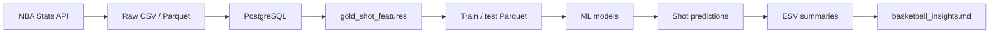

# CourtVision ML

End-to-end NBA shot-quality modeling: from public play-by-play data to expected shot value and player evaluation reports.

**Season:** 2024-25 · **Evaluation split:** 43,819 held-out shots (latest ~20% of games by date)

---

## What this project does

CourtVision ML predicts whether an NBA shot will go in, then turns those probabilities into basketball-facing analytics:

- **Shot make probability** — models shot difficulty from geometry, game context, rolling player/team form, and recent play-by-play sequence
- **Expected shot value (ESV)** — `predicted_make_probability × shot_value` (2 or 3 points)
- **Points above expected** — how much a player, team, or zone outperformed model expectation on the held-out test period
- **Basketball insights report** — player, team, zone, and monthly trend summaries for coaching and front-office-style evaluation

The repo mirrors a professional Basketball Operations ML workflow: raw ingestion, SQL-backed storage, validated feature tables, experiment tracking, model registry, leakage audits, evaluation layer, tests, and CI — not a single notebook.



---

## Headline results

- Built a full NBA shot-quality ML pipeline from public NBA data through PostgreSQL, MLflow, model registry, GRU inference, and basketball-facing reports.
- Trained a model ladder from logistic regression to LightGBM, MLP, and GRU sequence models.
- Best model: GRU spatial_sequence v3 with 62 tabular features plus 5 prior play-by-play events × 29 event features.
- Improved held-out log loss from 0.6495 with LightGBM to 0.6468 with GRU v3.
- Generated expected shot value summaries for 43,819 held-out NBA shots.

---

## Why I built it

I wanted a portfolio project that shows end-to-end ownership of a real sports ML system — not just model accuracy on a Kaggle CSV.

Basketball front offices care about questions like *who creates good shots* and *who finishes above expectation given difficulty*. Answering those requires careful data engineering (leakage-safe score margins and PBP sequences), a model ladder from baseline to production candidate to challenger, and a translation layer that turns probabilities into interpretable expected-value metrics.

CourtVision ML is that full stack: pipeline, models, registry, evaluation, and a readable report a coach or analyst could actually use.

---

## Data pipeline

Public NBA data is collected via [`nba-api`](https://github.com/swar/nba_api) (`src/courtvision/data/collect.py`) and stored as immutable raw files under `data/raw/`:

| Dataset | Source | Notes |
|---------|--------|-------|
| Shot charts | `shotchartdetail` | ~30 requests (one per team) |
| Player game logs | `playergamelogs` | Bulk request |
| Team game logs | `teamgamelogs` | Bulk request |
| Play-by-play | `playbyplayv3` | ~1,230 requests (one per game) |

**Clean → load → validate:** `load_data.py` validates with Pandera schemas and custom checks (`schemas.py`, `validate.py`), then loads into PostgreSQL (`sql/schema.sql`). Critical validation failures stop the pipeline; PBP gaps are warnings only.

**Feature build:** `build_features.py` joins shots, games, teams, rolling logs, and optional prior-event score margin into `gold_shot_features`, then exports time-based train/test Parquet (`data/processed/features/`).

**Split rule:** earliest ~80% of games by date → train (984 games, 175,708 shots); latest ~20% → test (246 games, 43,819 shots). No game appears in both splits.

---

## Feature engineering

Features are built in `src/courtvision/data/build_features.py` and stored in `gold_shot_features` (`feature_set_version`: `base_v1`).

| Group | Examples |
|-------|----------|
| Geometry & zones | `shot_distance`, `loc_x`, `loc_y`, `shot_angle`, `is_corner_three`, zone columns |
| Game state | `period`, `seconds_remaining_*`, `score_margin`, `score_margin_missing` |
| Player rolling (5-game, shifted) | `player_recent_fg_pct_5`, `player_recent_fga_5`, … |
| Team rolling | `team_recent_fg_pct_5`, `team_recent_pace_proxy_5`, … |
| Opponent rolling | `opp_recent_fg_pct_allowed_5`, `opp_recent_points_allowed_5`, … |

Rolling stats use **shift then roll** so the current game is never included. `score_margin` joins play-by-play on **prior-event** score snapshots only — never the shot outcome. A leakage audit (`audit_feature_leakage.py`) and `tests/test_score_margin.py` guard against label leakage.

**Modeling columns:** 31 tabular features for baseline / LightGBM (`src/courtvision/models/common.py`).

**Deep learning extras** (`spatial_features.py`, `sequence_features.py`, `pressure_features.py`):

- **Spatial branch** — 49 total tabular features after adding court-location encodings to the base feature set
- **Sequence branch** — prior 5 PBP events × 29 event-context features (strictly before the shot's `action_number`)
- **Pressure / summary (GRU v3)** — shot-clock proxies and aggregated counts from the prior-5 window (62 tabular inputs total)

---

## Model results

All models train on the same 2024-25 Parquet export and evaluate on the identical held-out test games.

| Model | Features | AUC | Log loss | Brier | Accuracy | Role |
|-------|----------|----:|---------:|------:|---------:|------|
| Logistic regression | 31 tabular | 0.6397 | 0.6610 | 0.2343 | 0.6062 | Baseline |
| LightGBM | 31 tabular | 0.6479 | 0.6495 | 0.2292 | 0.6213 | **Candidate** (MLflow registry) |
| MLP tabular | 31 tabular | 0.6437 | 0.6532 | 0.2307 | 0.6203 | Neural baseline |
| MLP spatial | 49 | 0.6443 | 0.6530 | 0.2306 | 0.6209 | Spatial neural |
| GRU spatial+sequence v2 | 49 + 5×26 seq | 0.6517 | 0.6470 | 0.2282 | 0.6233 | Challenger |
| **GRU spatial_sequence v3** | **62 + 5×29 seq** | **0.6516** | **0.6468** | **0.2282** | **0.6235** | **Challenger+** (best) |

LightGBM remains the registered **Candidate** (`courtvision-shot-make-model`) for simpler serving and registry-backed reproducibility. The GRU v3 model beats it on every reported test metric and drives the published expected-value report.

Detailed write-ups: `reports/baseline_model_report.md`, `reports/lightgbm_candidate_report.md`, `reports/deep_learning_report.md`.

---

## Best model: GRU spatial_sequence v3

**MLflow run ID:** `40fe1b8851f7423f831a77fce30b770d`  
**Artifacts:** `model_artifacts/gru/40fe1b8851f7423f831a77fce30b770d/`

The v3 GRU extends the v2 architecture with richer sequence features (possession-change flags, event timing) and 13 pressure/summary tabular columns derived from the prior-5 PBP window.

**Architecture:** tabular embed (62 → 64) + `GRU(29 → 64)` on 5 prior events → concat → MLP `64 → 32 → 1` (BCE, Adam, early stopping on inner validation log loss).

**Why Challenger+, not production Candidate:**

1. Serving needs live PBP sequence assembly, two preprocessors, and PyTorch — LightGBM is a single sklearn artifact on 31 features
2. Calibration has not been promoted to a separate production pass
3. Single-season training; no drift monitoring or API wiring yet

Sequence construction enforces `action_number < shot_event_id` for every prior event; the shot's own PBP row is never included. See `sequence_features.py` and `tests/test_sequence_features.py`.

---

## Expected shot value report

Phase 8 (`src/courtvision/evaluation/`) scores held-out shots and aggregates basketball-facing summaries:

| Metric | Formula |
|--------|---------|
| Expected shot value | `predicted_make_probability × shot_value` |
| Actual points | `shot_made_flag × shot_value` |
| Points above expected | `actual_points − expected_shot_value` |

**Published report:** [`reports/basketball_insights.md`](reports/basketball_insights.md) (GRU v3, 43,819 evaluation shots)

**Sample findings (min. 100 shots):**

- **Top total points above expected:** Kawhi Leonard (+44.8), Zach LaVine (+40.0), Nikola Jokić (+39.2)
- **Top rate per 100 shots:** Ty Jerome (+34.3), Keon Ellis (+29.9), Bogdan Bogdanović (+27.6)
- **Best team total:** LAC (+132.3), SAC (+111.6), MIL (+85.4)
- **Best zone (rate):** Mid-range left side center 16–24 ft (+8.9 per 100)

Summaries: `reports/tables/player_evaluation_2024-25.csv`, `team_evaluation_2024-25.csv`, `zone_evaluation_2024-25.csv`, `player_trends_2024-25.csv`.

---

## How to run

**Prerequisites:** Python 3.11, Docker (for PostgreSQL), virtual environment.

```powershell
py -3.11 -m venv .venv
.\.venv\Scripts\Activate.ps1
pip install -r requirements.txt
$env:PYTHONPATH = "src"
```

Copy `.env.example` → `.env`. Start PostgreSQL and apply schema:

```powershell
docker compose up -d postgres
Get-Content sql/schema.sql | docker compose exec -T postgres psql -U courtvision_user -d courtvision_ml
```

**Full pipeline (2024-25):**

```powershell
# 1. Collect raw data (~25–45 min; play-by-play is slowest)
python -m courtvision.data.collect

# 2. Validate and load into PostgreSQL
python -m courtvision.data.load_data --season 2024-25

# 3. Build features, load gold table, export train/test Parquet
python -m courtvision.data.build_features --season 2024-25 --load --inspect --export

# 4. Start MLflow (separate terminal)
.\scripts\start_mlflow.ps1

# 5. Train models
python -m courtvision.models.train_baseline
python -m courtvision.models.audit_feature_leakage
python -m courtvision.models.train_lgbm --mode search --register-candidate
python -m courtvision.models.train_gru --mode default

# 6. Expected shot value + insights (GRU v3)
python -m courtvision.evaluation.predict_shots --season 2024-25 --model-type gru --gru-run-id 40fe1b8851f7423f831a77fce30b770d
python -m courtvision.evaluation.summaries --season 2024-25 --predictions-path reports\tables\shot_predictions_2024-25_gru.csv
python -m courtvision.evaluation.write_insights --season 2024-25 `
  --model-label "GRU spatial_sequence v3 (Challenger+)" `
  --model-detail "GRU run ID: 40fe1b8851f7423f831a77fce30b770d"
```

Use `--model-type candidate` in step 6 for the registered LightGBM path (default registry-backed workflow).

**Quality checks:**

```powershell
ruff check .
pytest
```

---

## Key outputs

| Artifact | Path |
|----------|------|
| Basketball insights report | `reports/basketball_insights.md` |
| Shot predictions (GRU v3) | `reports/tables/shot_predictions_2024-25_gru.csv` |
| Shot predictions (LightGBM Candidate) | `reports/tables/shot_predictions_2024-25_candidate.csv` |
| Player / team / zone evaluation summaries | `reports/tables/*_evaluation_2024-25.csv` generated from GRU v3 predictions |
| Monthly player trends | `reports/tables/player_trends_2024-25.csv` |
| Model reports | `reports/baseline_model_report.md`, `lightgbm_candidate_report.md`, `deep_learning_report.md` |
| Model card | `reports/model_card.md` |
| Train / test features | `data/processed/features/train_shot_features_2024-25.parquet`, `test_shot_features_2024-25.parquet` |
| Registered model | MLflow `courtvision-shot-make-model` (alias `Candidate`) |

---

## Future work

| Area | Planned |
|------|---------|
| **Serving** | FastAPI inference for single-shot and batch prediction; GRU bundle with sequence assembly |
| **Dashboard** | Streamlit pages for shot quality, player evaluation, and model performance |
| **Calibration** | Platt / isotonic review by shot type and zone; compare GRU vs. LightGBM bins |
| **Monitoring** | Data drift, prediction drift, calibration tracking, retraining triggers |
| **Cloud** | AWS-style training path, artifact storage, SageMaker pipeline stub in `pipelines/` |
| **Data** | Multi-season training (2025-26+), lineup and defender-distance features |
| **Registry** | Formal Champion promotion criteria for GRU after API, calibration, and monitoring gates |

---

## Tech stack

Python 3.11 · PostgreSQL · pandas · scikit-learn · LightGBM · PyTorch · MLflow · FastAPI (planned) · Streamlit (planned) · Pandera · nba-api · pytest · Ruff · GitHub Actions
