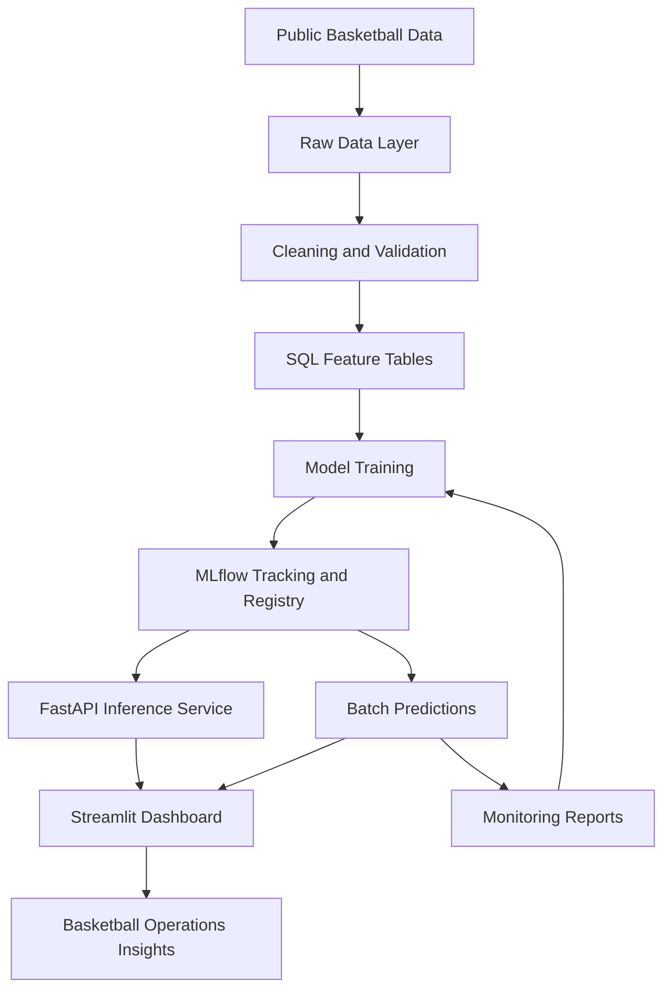

# CourtVision ML

CourtVision ML is a cloud-assisted basketball machine learning platform for shot quality modeling, player evaluation, and basketball operations decision support.

The project is designed to mirror a professional Basketball Operations machine learning workflow, including data ingestion, SQL-backed storage, feature engineering, model training, experiment tracking, model registry, API inference, dashboard delivery, monitoring, testing, documentation, and cloud-assisted retraining.

## Project Goal

The goal is to build an end-to-end basketball analytics system that answers:

- Which players generate high-quality shots?
- Which players outperform or underperform expected shot value?
- How can shot-level, player-level, and game-context data support player evaluation, game strategy, and player development?
- How can machine learning outputs be delivered as reliable tools for basketball decision makers?

## Role Alignment

CourtVision ML is built to align with a Data Scientist, Machine Learning role in Basketball Operations.

| Role Expectation | CourtVision ML Response |
|---|---|
| Build and productionize machine learning models | Shot quality model, expected shot value model, player evaluation metrics, FastAPI inference service |
| Design scalable data pipelines | Raw data ingestion, cleaned SQL tables, feature generation, validation, cloud-ready storage |
| Support basketball decision-making | Expected shot value, points above expected, zone profiles, player trend reports |
| Use modern ML workflows | MLflow tracking, model registry, repeatable training scripts, model artifacts, CI tests |
| Demonstrate testing and observability | pytest, Ruff, validation checks, model cards, monitoring reports |
| Communicate insights clearly | Streamlit dashboard and basketball-facing reports for coaches, analysts, and decision-makers |

## Planned System Architecture



## Core ML Tasks

- Shot make probability prediction
- Expected shot value modeling
- Player shot-making above expectation
- Shot quality profile by player, zone, and game context
- Player development trend analysis
- Model monitoring and retraining readiness

## Planned Features

### Data Pipeline

- Collect public basketball shot, player, team, and game data
- Store immutable raw data files
- Clean and normalize shot-level and player-level data
- Load structured data into SQL tables
- Create model-ready feature tables
- Validate data quality before training

### Machine Learning

- Train a baseline logistic regression model
- Train a tree-based candidate model using XGBoost or LightGBM
- Add a PyTorch model for deep learning comparison
- Evaluate models using AUC, log loss, Brier score, calibration, and accuracy
- Track experiments, parameters, metrics, and artifacts with MLflow
- Register the best model for API and dashboard use

### Basketball Evaluation Layer

- Calculate expected shot value
- Calculate points above expected
- Compare actual shooting performance against model expectations
- Build player-level summaries
- Analyze shot quality by player, team, shot zone, and game context
- Generate basketball-facing insights for player development and strategy

### API and Dashboard

- Build a FastAPI inference service
- Add endpoints for health checks, model information, single-shot prediction, batch prediction, and player evaluation
- Build a Streamlit dashboard for basketball decision support
- Show model performance, player trends, shot quality, and expected value insights

### MLOps and Cloud-Assisted Workflow

- Use MLflow for experiment tracking and model versioning
- Prepare cloud-ready configuration files
- Structure the project so training can run locally or in a cloud environment
- Add monitoring reports for data drift, prediction drift, and calibration
- Add GitHub Actions for automated linting and testing
- Keep data, models, secrets, and artifacts out of GitHub

## Tech Stack

- Python 3.11
- SQL
- pandas
- NumPy
- scikit-learn
- XGBoost
- LightGBM
- PyTorch, planned
- Matplotlib
- Plotly
- FastAPI
- Streamlit
- MLflow
- pytest
- Ruff
- Pydantic
- SQLAlchemy
- PostgreSQL or SQLite
- Docker, planned
- GitHub Actions
- AWS-style cloud-assisted ML workflow, planned

## Repository Structure

```txt
courtvision-ml/
├── README.md
├── pyproject.toml
├── requirements.txt
├── .gitignore
├── .env.example
├── .github/
│   └── workflows/
│       └── ci.yml
├── configs/
│   ├── local.yaml
│   ├── aws.yaml
│   └── model_config.yaml
├── data/
│   ├── README.md
│   └── sample/
├── notebooks/
├── sql/
│   ├── schema.sql
│   ├── feature_queries.sql
│   └── evaluation_queries.sql
├── src/
│   └── courtvision/
│       ├── __init__.py
│       ├── data/
│       │   ├── __init__.py
│       │   ├── collect.py
│       │   ├── clean.py
│       │   ├── validate.py
│       │   └── build_features.py
│       ├── models/
│       │   ├── __init__.py
│       │   ├── train.py
│       │   ├── evaluate.py
│       │   ├── predict.py
│       │   └── registry.py
│       ├── monitoring/
│       │   ├── __init__.py
│       │   ├── drift.py
│       │   ├── calibration.py
│       │   └── performance_report.py
│       ├── api/
│       │   ├── __init__.py
│       │   ├── main.py
│       │   └── schemas.py
│       └── utils/
│           ├── __init__.py
│           ├── config.py
│           └── logging.py
├── dashboard/
│   ├── app.py
│   └── pages/
├── pipelines/
│   ├── run_local_pipeline.py
│   └── sagemaker_pipeline.py
├── tests/
│   └── test_smoke.py
└── reports/
    ├── model_card.md
    ├── basketball_insights.md
    └── cloud_architecture.md
```

## Local Setup

Create a Python 3.11 virtual environment:

```powershell
py -3.11 -m venv .venv
```

Activate the virtual environment on Windows PowerShell:

```powershell
.\.venv\Scripts\Activate.ps1
```

Upgrade pip:

```powershell
python -m pip install --upgrade pip
```

Install dependencies:

```powershell
pip install -r requirements.txt
```

## Environment Variables

Create a local `.env` file based on `.env.example`.

Example:

```env
ENVIRONMENT=development
DATABASE_URL=sqlite:///courtvision.db
MLFLOW_TRACKING_URI=./mlruns
MODEL_REGISTRY_PATH=models/
AWS_REGION=us-east-1
S3_BUCKET=
```

Do not commit real secrets, keys, credentials, or cloud account information.

## Quality Checks

Run Ruff linting:

```powershell
ruff check .
```

Run tests:

```powershell
pytest
```

## GitHub Actions

This project uses GitHub Actions to run automated checks on every push and pull request to `main`.

The CI workflow will:

1. Check out the repository
2. Set up Python 3.11
3. Install dependencies
4. Run Ruff linting
5. Run pytest

## Development Phases

### Phase 0: Project Setup and Professional Repo Foundation

- Create GitHub repository
- Create Python 3.11 virtual environment
- Install core dependencies
- Create professional folder structure
- Add README
- Add `.gitignore`
- Add Ruff configuration
- Add GitHub Actions workflow
- Add smoke test

### Phase 1: Data Acquisition and Storage

- Choose public basketball data sources
- Collect shot, game, player, and team data
- Save raw data locally
- Add metadata files for source, season, download date, and row counts
- Convert reusable files to efficient formats such as Parquet

### Phase 2: SQL Schema and Cleaned Data Tables

- Create database schema
- Load cleaned data into SQL
- Create tables for players, teams, games, shots, features, predictions, and player evaluation
- Add row count and data quality queries

### Phase 3: Data Validation

- Validate required IDs, dates, shot values, and coordinate ranges
- Check missing values and duplicate rows
- Fail the pipeline if critical checks do not pass

### Phase 4: Feature Engineering

- Build shot geometry features
- Build player rolling features
- Build team and opponent context features
- Build game-state features
- Export model-ready feature tables

### Phase 5: Baseline Modeling

- Train logistic regression baseline
- Use a time-based train/test split
- Evaluate AUC, log loss, Brier score, calibration, and accuracy
- Log results to MLflow

### Phase 6: Tree-Based Production Candidate

- Train XGBoost or LightGBM model
- Compare against baseline
- Create feature importance report
- Register candidate model

### Phase 7: Deep Learning and Spatial Modeling

- Train PyTorch model
- Add spatial features from shot location
- Compare against tree-based model
- Document whether deep learning improves results

### Phase 8: Expected Shot Value and Player Evaluation

- Generate predictions for all evaluation shots
- Calculate expected shot value
- Calculate points above expected
- Build player evaluation summaries
- Write basketball-facing insights

### Phase 9: Cloud-Assisted Training Path

- Add AWS-style configuration
- Prepare training code to run locally or in cloud
- Store artifacts in a cloud-ready structure
- Log cloud or cloud-ready training runs to MLflow

### Phase 10: Inference API

- Build FastAPI app
- Add model info and prediction endpoints
- Validate inputs with Pydantic
- Add API tests

### Phase 11: Streamlit Dashboard

- Build Overview page
- Build Shot Quality Explorer
- Build Player Evaluation page
- Build Model Performance page
- Display basketball insights clearly

### Phase 12: Monitoring and Retraining

- Create drift report
- Track prediction distribution
- Track calibration by shot type and zone
- Define retraining triggers

### Phase 13: Final Documentation and Polish

- Complete model card
- Complete basketball insights report
- Complete cloud architecture report
- Add screenshots or demo video
- Finalize resume bullets and interview talking points

## Current Status

Phase 0 is in progress.

## Final Project Outcome

The finished project should demonstrate the ability to build a production-style basketball machine learning platform that moves beyond a simple notebook. The goal is to show end-to-end ownership across data pipelines, machine learning, model evaluation, model serving, dashboard delivery, monitoring, documentation, and basketball decision support.