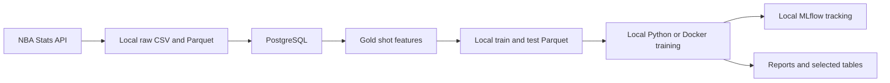
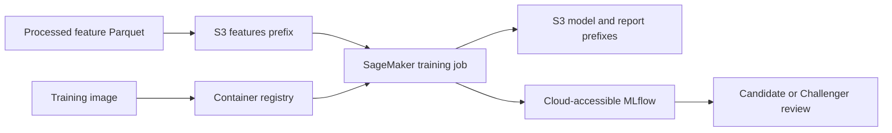

# Cloud Architecture - Current State and AWS Target

Last updated: 2026-06-18

## Status

CourtVision currently has a working local and Docker training path. It does **not** yet have an implemented SageMaker pipeline, S3 upload command, cloud MLflow deployment, or recorded managed training run.

`configs/aws.yaml` is configuration scaffolding. `pipelines/sagemaker_pipeline.py` is an empty placeholder. The target design below is a plan, not a claim that AWS resources are deployed.

## Current implemented architecture

Implemented components:

- Config-driven LightGBM training through `courtvision.models.train`
- Local pipeline orchestration through `pipelines/run_local_pipeline.py`
- Python 3.11 Linux training image in `Dockerfile.train`
- Separate pinned Windows and Linux dependency files
- Local PostgreSQL and MLflow services
- Local MLflow model logging and LightGBM Candidate registration

## Minimum credible AWS target

The first cloud milestone should remain deliberately small:

1. Upload the existing processed feature files to S3.
2. Publish or reference the training container from a registry accessible to SageMaker.
3. Submit one LightGBM training job using the same config-driven entry point as local/Docker execution.
4. Store model outputs and reports under the configured S3 prefixes.
5. Record metrics and artifacts in a cloud-accessible MLflow server, or document the temporary artifact handoff if MLflow is deferred.

## Configuration contract

`configs/aws.yaml` currently defines:

| Setting | Current value / purpose |
|---------|-------------------------|
| `environment` | `aws` |
| `aws_region` | `us-east-1` |
| `s3_bucket` | `courtvision-ml` target name |
| `s3_prefixes.raw` | Raw-source objects |
| `s3_prefixes.processed` | Cleaned/processed objects |
| `s3_prefixes.features` | Train/test feature exports |
| `s3_prefixes.models` | Model artifacts |
| `s3_prefixes.reports` | Evaluation reports |
| `mlflow_tracking_uri` | Empty until a reachable service exists |
| `database_url` | Empty until a cloud database is required |

Bucket names are globally unique and the configured name may need to change. Runtime credentials must come from an IAM role or approved local AWS credential provider, never from committed configuration.

## Security and operations

- Use a least-privilege SageMaker execution role scoped to required bucket prefixes and image access.
- Keep credentials, account IDs, private endpoints, and secrets outside git.
- Enable S3 encryption and block public access.
- Tag cloud resources with project, environment, and owner metadata.
- Set budget alerts before managed training experiments.
- Log the image digest, git commit, config, input S3 URIs, output URIs, and job name for reproducibility.
- Avoid placing the PostgreSQL training database on the public internet; the first managed job should consume exported features from S3.

## Reproducibility contract

A cloud run should preserve:

- Git commit SHA
- Container image URI and immutable digest
- Dependency lock used by the image
- Training command and resolved configuration
- Input feature object versions or checksums
- Time split and season
- Random seed
- Metrics and MLflow run ID
- Output model/report S3 URIs

## Completion checklist

- [ ] S3 bucket and prefixes provisioned
- [ ] Processed features uploaded with checksums
- [ ] Training image published to an accessible registry
- [ ] `pipelines/sagemaker_pipeline.py` implemented and unit tested with mocked AWS calls
- [ ] Managed training job or documented no-submit dry run recorded
- [ ] Metrics and artifacts retrieved successfully
- [ ] Cloud MLflow path verified or deferral documented
- [ ] Cost, IAM, and cleanup instructions documented

Until these boxes are satisfied, Phase 9 remains in progress.
